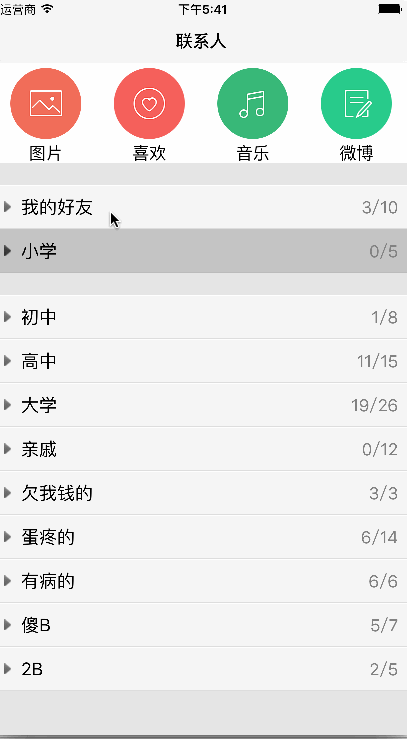

# QQFriendList
###QQ联系人列表

- 首先说说实现思路
 - 自定义UITableView，每一个分组都是一个`UITableViewHeaderFooterView`,然后自定义`cell`，这里分组的实现主要是自定义`UITableViewHeaderFooterView`，这个折叠效果主要靠这个header的响应
- 本文参考自[QQFriendList](http://www.cnblogs.com/songliquan/p/4793352.html)
- 在这个基础上加了一些效果

###效果如下:

